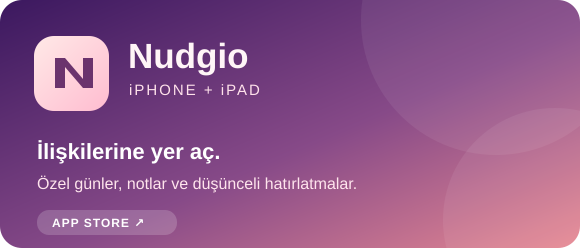
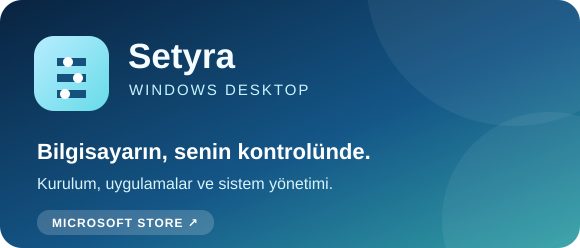

  
  

    
    
  

Web, iOS ve Windows için günlük hayatta işe yarayan ürünler geliştiriyorum. Fikri çalışan bir uygulamaya dönüştürmek; arayüz, servis ve dağıtımın tamamıyla ilgilenmek en sevdiğim kısım.

## Uygulamalarım

<table>
  <tr>
    <td width="50%" valign="top">
      
      
Önemli insanları, doğum günlerini ve özel tarihleri hatırlamayı kolaylaştıran kişisel düzenleyici.

      
    </td>
    <td width="50%" valign="top">
      
      
Windows kurulumu, uygulama yönetimi, sistem bilgileri ve geri alınabilir ayarları tek yerde toplayan masaüstü uygulaması.

      
    </td>
  </tr>
</table>

## Seçilmiş projeler

| Proje | Ne yapıyor? | Bağlantılar |
| --- | --- | --- |
| **ServiceFlow** | Müşteri, yönetici ve teknisyen akışlarını kapsayan saha servis yönetimi uygulaması. | [Canlı demo](https://serviceflow-web-ten.vercel.app/) · [Kod](https://github.com/bulutbirol/FSM-Platform-Project) |
| **Shortlink** | Hesaplar, kısa bağlantılar ve tıklanma istatistikleri sunan tam yığın URL kısaltıcı. | [Canlı demo](https://shortlink-web-eight.vercel.app) · [Kod](https://github.com/bulutbirol/Link-Shortener) |
| **Fiyatın Anatomisi** | Teknoloji ürünlerinin fiyat farklarını açıklayan Türkçe ve İngilizce ürün rehberi. | [Kod](https://github.com/bulutbirol/priceplatform) |
| **SMMM Soru Bankası** | Sınav sorularını açıklamalar, filtreler ve çalışma istatistikleriyle sunan uygulama. | [Kod](https://github.com/bulutbirol/Soru-bankasi) |

  Daha fazlası için <a href="https://birolweb.dev">birolweb.dev</a> adresini ziyaret edebilirsin.

