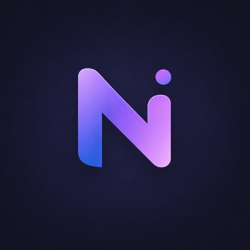

  
  <h1>Selam, ben Birol 👋</h1>
  
Web ve uygulama geliştirmeyle uğraşıyorum. Aklıma gelen fikirleri denemeyi, arayüzleriyle oynamayı ve ortaya çalışan bir şey çıkarmayı seviyorum.

  
<a href="https://birolweb.dev">Web sitem</a> · <a href="https://github.com/bulutbirol?tab=repositories">Tüm projelerim</a>

## Uygulamalarım

<table>
  <tr>
    <td width="50%" valign="top">
      
      <h3><a href="https://apps.apple.com/app/id6761790991">Nudgio</a></h3>
      
Doğum günlerini ve önemli tarihleri unutmamak için bir hatırlatıcı.

      
<a href="https://apps.apple.com/app/id6761790991">App Store'da aç →</a>

    </td>
    <td width="50%" valign="top">
      
      <h3><a href="https://apps.microsoft.com/detail/9NLT1JT7R800">Setyra</a></h3>
      
Windows kurulumu, uygulamalar ve sistem ayarları için masaüstü yardımcısı.

      
<a href="https://apps.microsoft.com/detail/9NLT1JT7R800">Microsoft Store'da aç →</a>

    </td>
  </tr>
</table>

## Seçilmiş projeler

| Proje | Kısaca | Bağlantılar |
| --- | --- | --- |
| **ServiceFlow** | Saha servis işlerini müşteri, yönetici ve teknisyen tarafında takip etme uygulaması. | [Demo](https://serviceflow-web-ten.vercel.app/) · [Kod](https://github.com/bulutbirol/FSM-Platform-Project) |
| **Shortlink** | Kısa bağlantı oluşturma ve tıklanma istatistiklerini görme uygulaması. | [Demo](https://shortlink-web-eight.vercel.app/) · [Kod](https://github.com/bulutbirol/Link-Shortener) |
| **SMMM Soru Bankası** | SMMM sınavına hazırlanırken soru çözmek ve ilerlemeyi takip etmek için. | [Demo](https://smmm-soru-bankasi.vercel.app/) · [Kod](https://github.com/bulutbirol/Soru-bankasi) |
| **Pizza** | React ile hazırlanmış pizza siparişi temalı bir arayüz. | [Kod](https://github.com/bulutbirol/fsweb-s8-challenge-pizza) |
| **E-Commerce Project** | Ürün listeleme, detay ve hesap sayfaları içeren bir e-ticaret arayüzü. | [Kod](https://github.com/bulutbirol/E-Commerce-Project) |

  Diğer işlerime de <a href="https://github.com/bulutbirol?tab=repositories">buradan</a> bakabilirsin.

